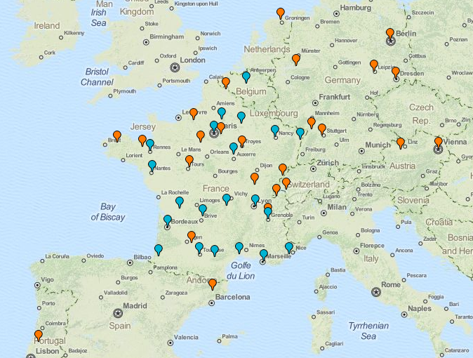

# Neutrinet and the Federation FDN aka <i>DIY ISP</i> 

---

# A little bit of history...

---

# At the beginning there was FDN ... <small><i><b>not</b> FFDN</i></small>

---

# FDN - French Data Network

* old ISP in France, founded in 1992
* non-profit
* no employee
* by its members, for its members
* small size
* offer DSL connection
* No subscribers, members! (they have the right to votes)
* democratic
* Can be seen as a group of friends making internet together

---

# FDN - French Data Network

* old ISP in France, founded in 1992
* non-profit
* no employee
* by its members, for its members
* small size
* offer DSL connection
* No subscribers, members! (they have the right to votes)
* democratic
* Can be seen as a group of friends making internet together

# Politically engaged

* fight for net neutrality
* against Hadopi 1 2 & 3, Loppsi 1 & 2 and all the other stupid French laws...
* (quite close to La Quadrature du Net)
* Internet access during Arab springs

---

# FDN

# Problem

* grow too much (lot of (very good) talks by its president of that time Benjamin Bayart)
* was reaching 200 members

---

# FDN

# Problem

* grow too much (lot of (very good) talks by its president of that time Benjamin Bayart)
* was reaching 200 members

# Consequences

* Lost of this human size
* "I'm not able to know my members individually anymore" - Benjamin Bayart
* Starting to looks like "yet another big ISP"
* centralized

---

# FDN

# Problem

* grow too much (lot of (very good) talks by its president of that time Benjamin Bayart)
* was reaching 200 members

# Consequences

* Lost of this human size
* "I'm not able to know my members individually anymore" - Benjamin Bayart
* Starting to looks like "yet another big ISP"
* centralized

# Solution

* Refuse new members? Nope, it sucks
* So...

---

# Let's make a Federation \o/

---

# In 2011 the Federation FFDN (or FFDN) is launched

---

# The Federation FDN

# At that time

* 7 ISP (Aquilenet, FDN, Franciliens.net, Ilico, Lorraine Data Network (LDN), Sames Wireless and tetaneutral)
* creation of a chart for joining (basically the principles of FDN: net neutrality, non profit, no employees, no subscribers but members, associative, democratic etc...)
* Strategy of that time was making local ISP (centered around big Towns or regions)
* Some new technologies introduced by members: Wifi, plans for fiber

---

# The Federation FDN

# At that time

* 7 ISP (Aquilenet, FDN, Franciliens.net, Ilico, Lorraine Data Network (LDN), Sames Wireless and tetaneutral)
* creation of a chart for joining (basically the principles of FDN: net neutrality, non profit, no employees, no subscribers but members, associative, democratic etc...)
* Strategy of that time was making local ISP (centered around big towns or regions)
* Some new technologies introduced by members: Wifi, plans for fiber

# Advantages

* Human size again
* Local (so better suited for local problems for example "white zones")
* Decentralized -> harder for the government to control (censorship with 4 big ISP != censorship with zillion of ISP)
* Members are very easily able to offer DSL access thanks to FDN backhaul contract (they can resell it under their name)

---

# The Federation FDN - Today

* 26 ISP - 2105 members (including 1288 members with a subscription) and growing fast!
* Politically engaged: a **lot** of legal recourses against stupid action of the French government (and there are many)
* Technologies: ADSL, Wifi, VPN, Internet Cube (la brique internet) and some hosting

---

# Neutrinet

---

# This will looks familiar...

---

# Neutrinet

* can be summarised as "Let's do FDN in Belgium!"
* but without money and knowledge at first...
* Launched in 2010
* Local DIY ISP in Belgium (centered around Brussels)
* Slow start ... but works quite well now

---

# Neutrinet

# Today

* Member of the FFDN (in 2014)
* 40 members (including 28 subscribers) and growing fast
* Provide "Net neutralizor VPN access": static ip (v4 and v6), encryption and not port filtering
* Launched and provide the Internet Cube with LDN (Lorraine Data Network)
* We just got our own physical server (and are doing the migration)

---

# Neutrinet

# Today

* Member of the FFDN (in 2014)
* 40 members (including 28 subscribers) and growing fast
* Provide "Net neutralizor VPN access": static ip (v4 and v6), encryption and not port filtering
* Launched and provide the Internet Cube with LDN (Lorraine Data Network)
* We just got our own physical server (and are doing the migration)

# Future

* Relaunch Reseau Citoyen (open wifi network in Brussels)
* Improve community side
* Opportunities around fibers in some buildings in Brussels

---

# Neutrinet's life

* work meeting every 2 or 3 weeks (generally at 123 rue royale or at the WTC)
* "members afternoon" every 3rd Sunday of every month (open to everyone)
* often holding stand at events to spread to good word
* current focus on the Internet Cube and improving our backoffice
* most of the work is **not** technical (but there are technical work if you want)
* self organised, small core team of motivated and active people
* focus on having a good atmosphere and having fun

 

<h1 style="font-size: 4em">Join us \o/</h1>

---

# Links

* FFDN: http://ffdn.org
* ISP map: http://db.ffdn.org
* DIY ISP: http://www.diyisp.org
* Neutrinet: http://neutrinet.be
* Internet Cube: http://internetcu.be

 

<h1 style="font-size: 4em">Questions?</h1>

