# How To Make An ISP <small>(simple version)</small>

---

# Situation

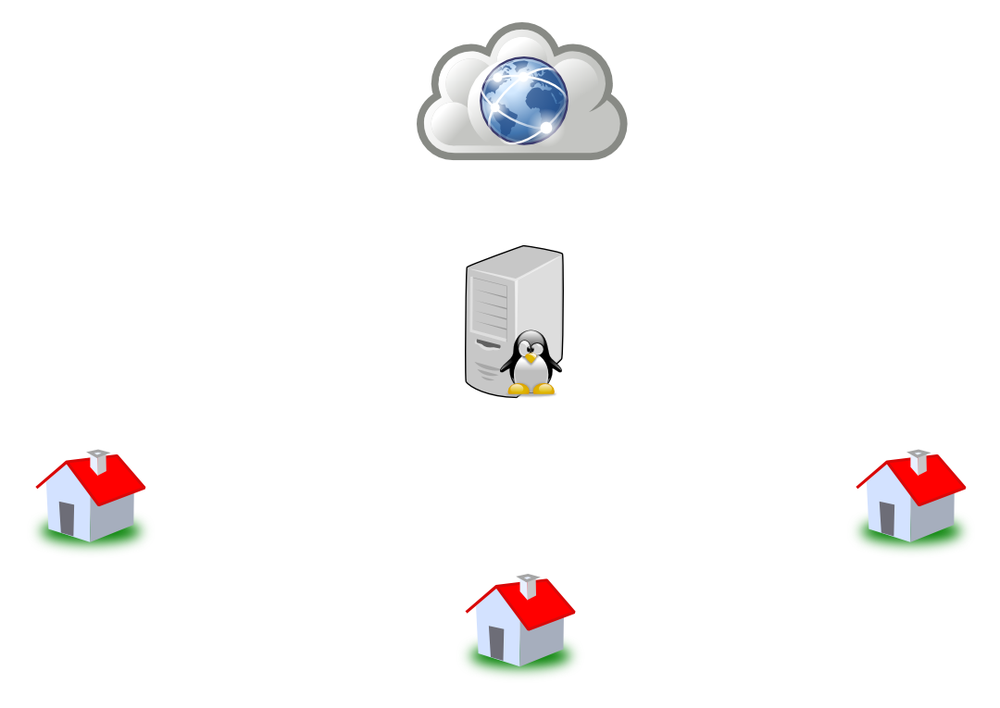

---

# Situation

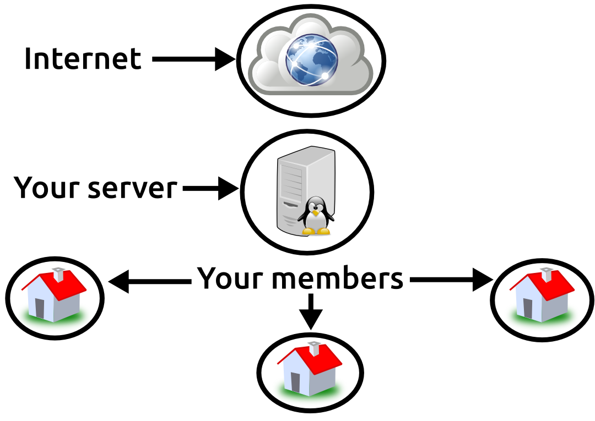

---

# Problems to solve

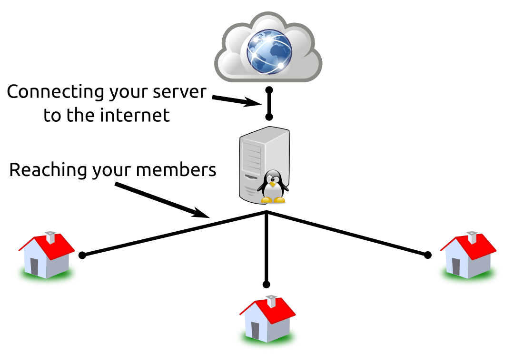

---

# Problems to solve: access the Internet

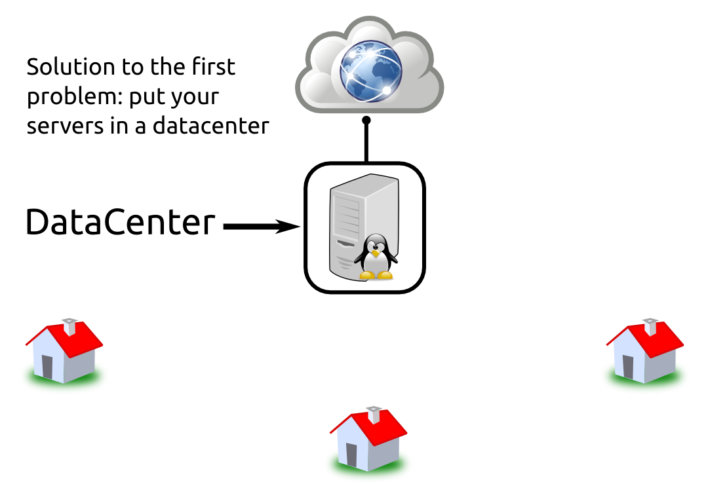

---

# Problems to solve: reaching your members

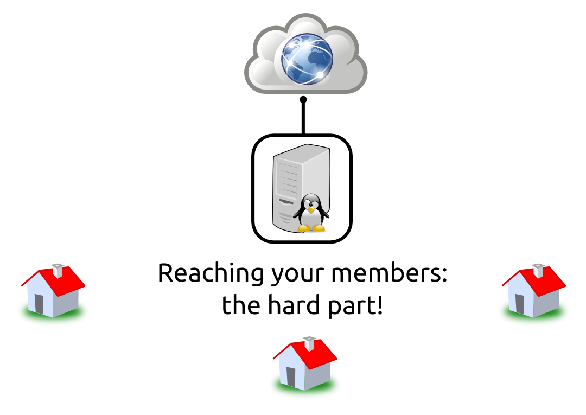

---

# Solution: VPN <small>the easy solution or "virtual ISP"</small>

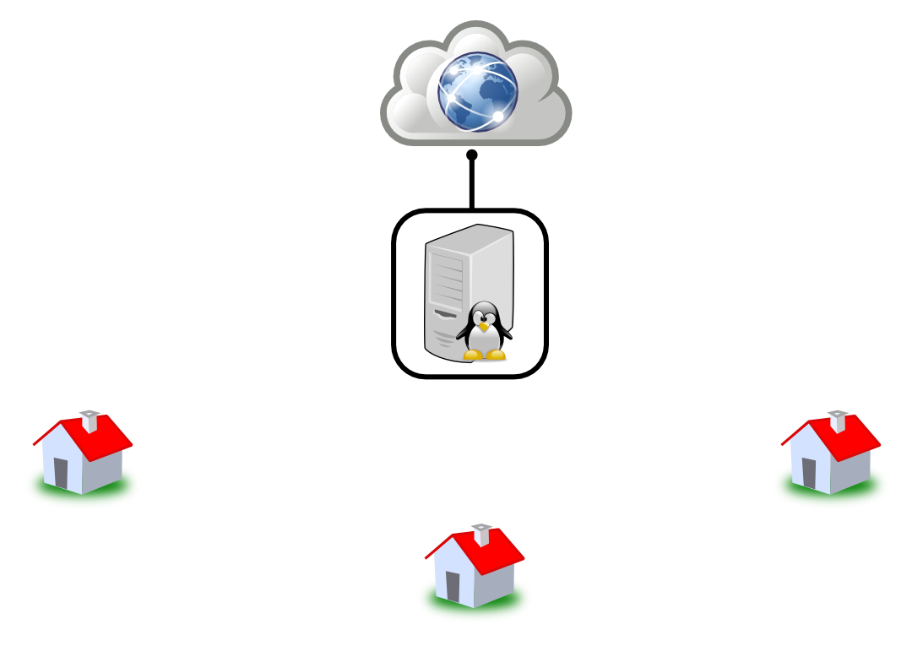

---

# Solution: VPN <small>the easy solution or "virtual ISP"</small>

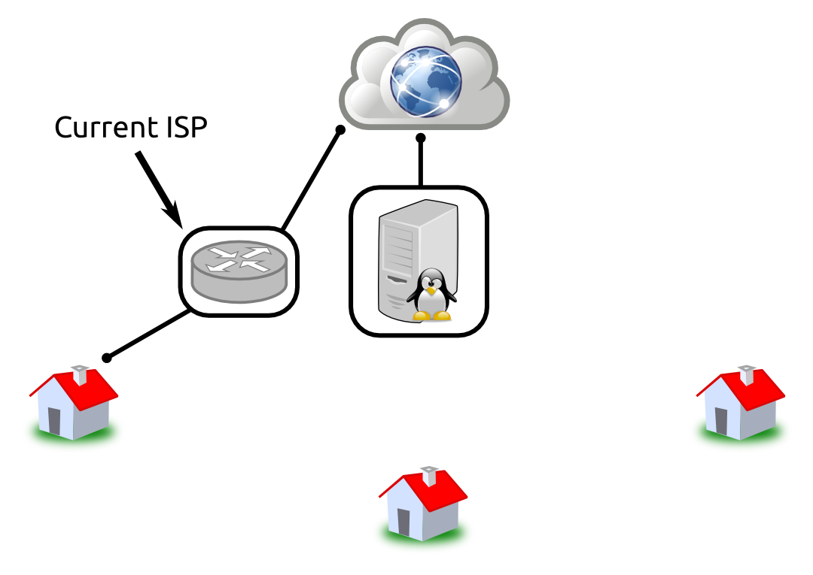

---

# Solution: VPN <small>the easy solution or "virtual ISP"</small>

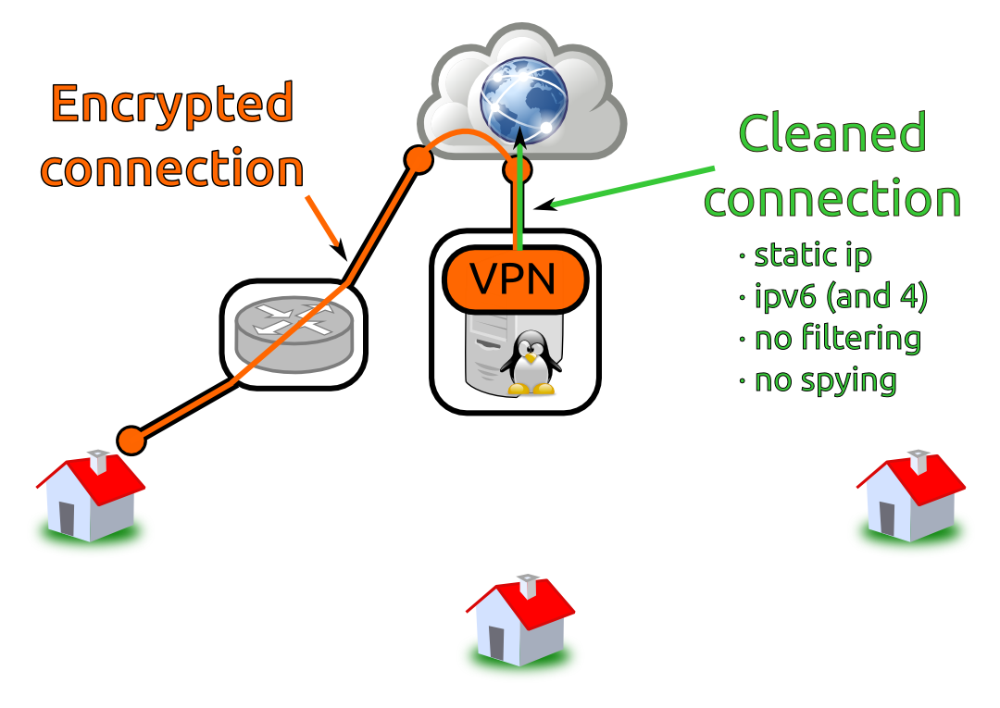

---

# Solution: Wifi

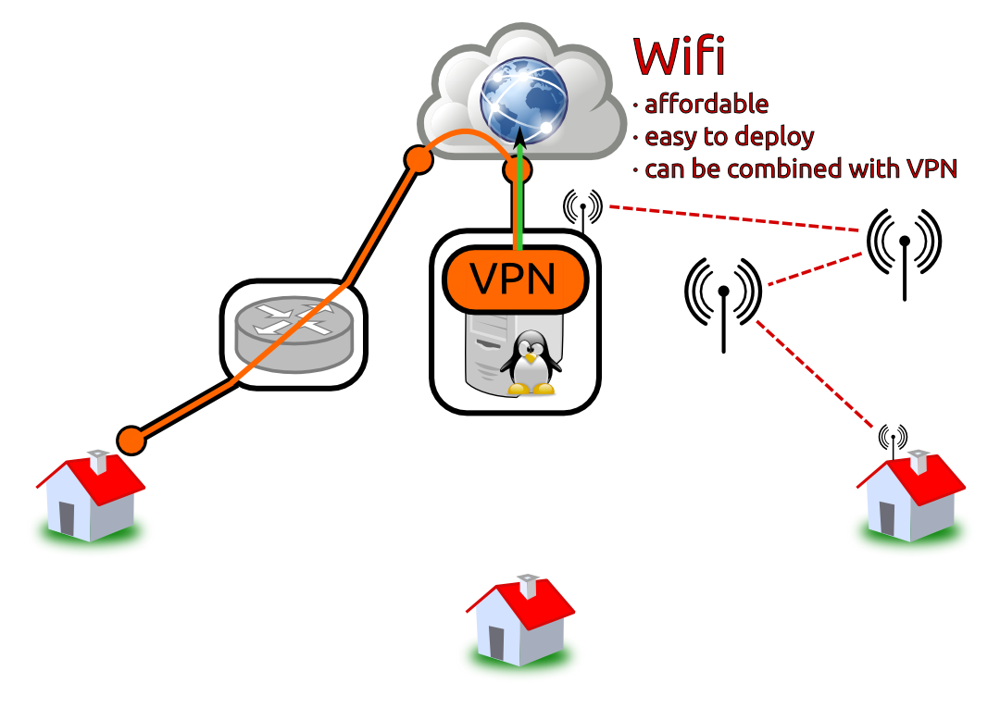

---

# Example : reseau citoyen

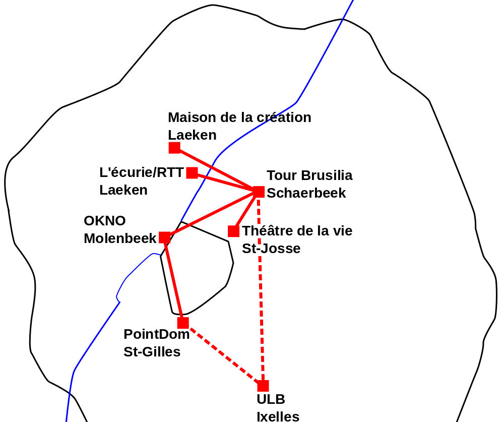

---

# Example : Guifi

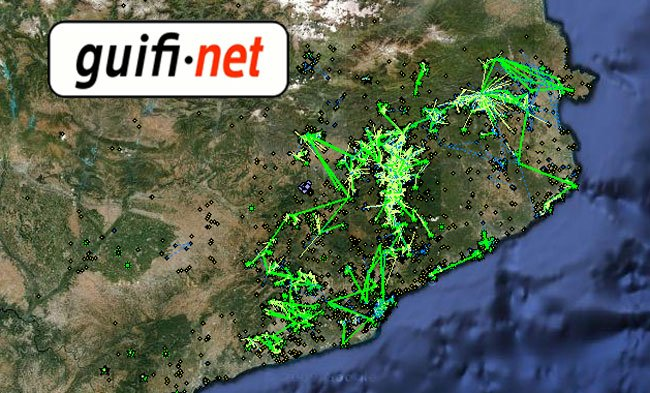

In Catalogne (Spain), also do fiber

---

# Solution: Backhaul contract

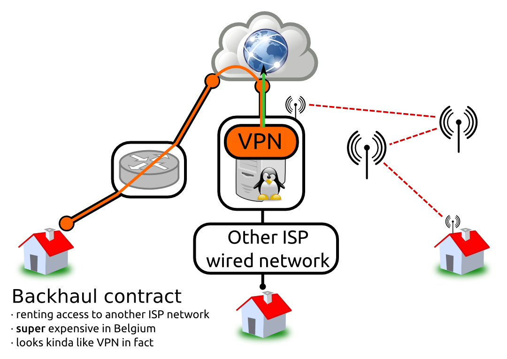

---

# Other super expensives/complicated solutions

 

* wiring the country with coper or fiber (cost billions, legal obstacles)
* mesh networking : like wifi but super complicated and doesn't scale at all
* 4G 5G etc ... licence cost millions
